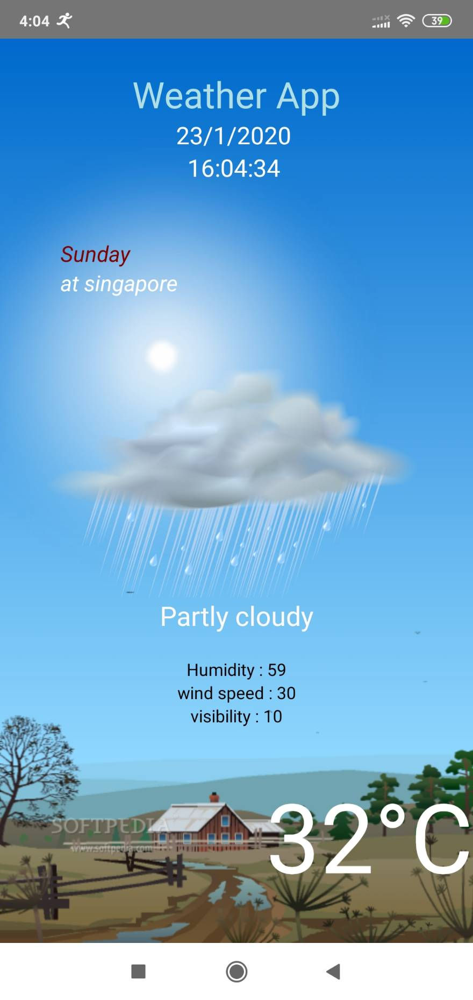

Weather Mobile App
==========

Weather mobile app using react native. Get detail of the weather using weatherstack API

Dependencies
--------

- react
- react-native
- react-navigation

Installation
------------

Clone this repository, and run:

    yarn install

   or
   
    npm install

## Run code

In the project directory, you can run:

### `npm run android`

Runs the app in the development mode in android emulator. you can run on your own device by using Expo or run the code while connecting your device to the computer via USB 

The page will reload if you make edits. 
You will also see any lint errors in the console.

### `npm run ios`

(works on mac only) Runs the app in the development mode in ios emulator. you can run on your own device by using Expo or run the code while connecting your device to the computer via USB 

The page will reload if you make edits. 
You will also see any lint errors in the console.

see more at the official website [here](https://facebook.github.io/react-native/docs/getting-started)
